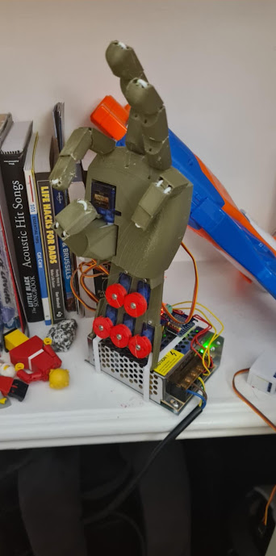
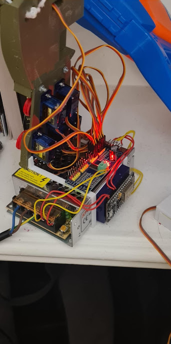

# Chronodactyl

## Overview
Chronodactyl is a 3D-printed robotic hand clock that displays the time in binary using its fingers. The hand uses six servos — five for controlling the fingers and one for the thumb knuckle joint — and elastic "ligaments" to create realistic movements. 

The time is shown in binary, where each finger represents a different place value (e.g., 1, 2, 4, 8, 16), and the hand's position reflects the current time.

Every 15 minutes, Chronodactyl runs an animation sequence that visually represents the position of the hour (quarter-past, half-past etc). The system is powered by a NodeMCU microcontroller, with servo control handled by a PCA9685 servo driver. It is powered by a 5V 20A power supply to ensure smooth simultaneous operation of all servos. Time is retrieved by NTP request.

Front            |  Back
:-------------------------:|:-------------------------:
  |  